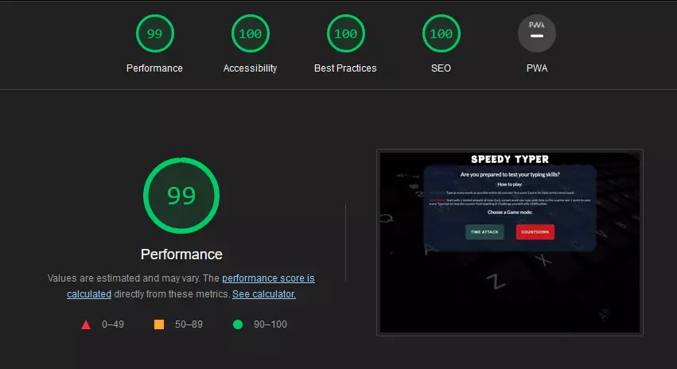
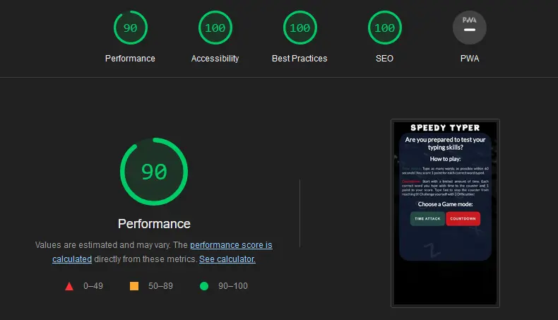
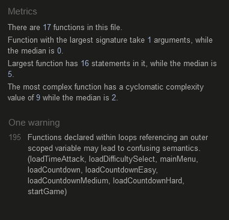

<h1 align="center">Speedy Typer</h1>

## Introduction
Speedy Typer is a Javascript based web game that allows users to test their typing skills through two unique game modes. This game is aimed at those who wish to test their typing skills and play a simple, fun game to try and challenge themselves to beat their high score. The game has 2 modes - 'Time Attack' and 'Countdown', to provide the user with a choice in how they wish to play.

[The live site can be accessed here.](https://jackday94.github.io/project2_speedy_typer/)

## Table of Contents

1. [Site Goals](#site-goals)
    - [User Stories](#user-stories)
    - [Site Owner Goals](#site-owner-goals)
2. [Design](#design)
    - [Colours](#colours)
    - [Font Styles](#font-styles)
    - [Images](#images)
    - [Wireframes](#wireframes)
3. [Features](#features)
    - [Existing Features](#existing-features)
    - [Future Features](#future-features)
4. [Technologies](#technologies)
5. [Testing](#testing)
    - [Validator Testing](#validator-testing)
    - [Feature Testing](#feature-testing)
    - [Responsiveness](#responsiveness)
    - [Known Bugs](#known-bugs)
6. [Deployment](#deployment)
    - [Local Deployment](#local-deployment)
7. [Credits](#credits)
    - [Content](#content)
    - [Media](#media)

## Site Goals

### User Stories

- As a new user, I want to be able to navigate through the site easily and quickly to find the game I want.
- As a new user, I want the instructions on how to play the game to be clear and concise.
- As a new user, I want the site to be responsive when played on smaller devices.
- As a new user, I want the design of the site to be simple and appealing.
- As a new user, I want to be able to type a variety of words to improve my typing skills.
- As a returning user, I want to be able to see my previous high score for each game mode.
- As a returning user, I want to be able to change the difficulty of the game to challenge myself.

### Site Owner Goals

- As a site owner, I want to create a simple fun game to help improve typing skills.
- As a site owner, I want to be able to store user high scores for returning use.
- As a site owner, I want to provide an easy to navigate game that works with different devices.
- As a site owner, I want to give users an option between different game modes.
- As a site owner, I want the design of my site to be appealing but not distracting from the main content. 

## Design

### Colours
I tried to keep the colours simple for the site, with the main font colour set to white to contrast the darker background and make the main content stand out. I chose to distinguish the 2 game modes with different colours so that the user can easily identify which mode they are playing. Likewise, the different difficulties are represented by a traffic light style colour scheme to help the user identify the difficulty they are playing.

### Font Styles
As the site is based around a typing game, I wanted the main font style to be clear and easily readable for the user. For this I used Google Fonts to choose the 'Lato' font style for the main game section content. I also wanted the main heading to seem playful to represent a game. I used Google Fonts and chose the 'Potta One' style for this.

### Images
Since the main purpose of the site is to play the typing game - I didn't want to overload the user with images, so I chose to only use a single image of a keyboard for the background of the site.

### Wireframes
I created the wireframes for this project using Balsamiq Wireframes.

Desktop

Mobile

## Features

### Existing Features

- __Main Menu__
    - This is the first page the user is met with when they load the site.
    - It provides information that tells the user how to play the game and what the different game modes are.
    - There are two buttons that take the user to the different game modes. 'Time Attack' loads the time attack game mode, and 'Countdown' loads the difficulty select menu for the countdown game mode.

- __Difficulty Select__
    - From this menu, the user can choose between the 3 difficulty options for the 'Countdown' game.
    - 3 large navigation buttons load the countdown game at a difficulty of the user's choice - Easy, Medium or Hard.
    - A home button at the bottom of the page takes user's back to the main menu when clicked.

- __Time Attack Game__
    - This is the game that is displayed when the user selects the 'time attack' button from the main menu.
    - The game features a start button that will set the timer to 60 seconds, display a random word, enable the text input box, disable the button and set the score to 0.
    - When the timer starts, it will begin to countdown by 1 second for 60 seconds until it reaches 0.
    - While the timer is active, the user must type the word that is displayed above the input box to score 1 point. Everytime the words match, the word above the input box is randomised from an array of words.
    - The high score is set when the user's score is greater than the high score value that is stored in local storage.
    - When the timer reaches 0, the input box is disabled and the start button is enabled again.
    - A home button at the bottom of the page will take the user back to the main menu.

- __Countdown Game__
    - This is the game that is displayed when the user selects 'countdown' from the main menu and chooses a difficulty.
    - The basic features and functionality of this game are the same as the time attack game mode.
    - Countdown starts the user with a limited amount of time depending on which difficulty they select. Easy starts with 8 seconds, Medium with 5, and Hard with 3.
    - Each time the user matches their word to the random word, the current time on the timer is increased by 2 seconds.
    - The timer will continue to countdown until it reaches 0, at which point the game ends. The user must therefore type as fast as possible to prevent the timer reaching 0.
    - The game displays the difficulty the user is playing on just above their score.
    - There are seperate high scores for each difficulty stored in local storage to prevent the user from overlapping their high score from a lower difficulty to a higher one.

### Future Features

- Game Sounds
    - I feel that adding sounds to the game would be a good way to improve the user experience. For example, a chime sound could play when the user enters a correct answer which would give them audio feedback that they answered correctly. Also sounds could play when the timer is low to let the user know that they are running low on time.

- Leaderboards
    - I would like to add a leaderboard which keeps a record of high scores and allows the user to enter their name to display ther score in the leaderboard. This could make the game more attractive to competetive players who wish to aim for the highest spot on the leaderboard.

- Game start on typing
    - I would like to make the game start when the user starts to type in the text box rather than using a start button. This would make starting the game more fluid as the user can just use their keyboard to start the game, rather than clicking on a button.

## Technologies

- HTML5 - Used for the structure and content of my web pages.
- CSS3 - Used for the styling of pages.
- JavaScript - Used to implement the interactive features of the site and create the main functionality of the game.
- [Font Awesome](https://fontawesome.com/) - For the timer icon used in the games.
- [Google fonts](https://fonts.google.com/) - Used to choose the fonts for my site.
- [favicon.io](https://favicon.io/) - Used to create the favicon for the site.
- [Gitpod](https://www.gitpod.io/) - Used as my code editor.
- [GitHub](https://github.com/) - Used for deploying and hosting my site.

## Testing

### Validator Testing

- HTML
    - No errors displayed when checking with the W3C markup validation service.

- CSS
    - No errors displayed when checking with the W3C CSS validation service.

- Google Lighthouse
    - Google lighthouse gave the site a score of 100 for all categories except performance, which was shown as 90 for mobile and 99 for desktop.

- JSHint
    - JSHint only displayed one warning about declaring functions in loops, but this is required in the project to enable the buttons to operate correctly.

### Feature Testing

- Buttons
    - I tested that all buttons operate as they should, by repeatedly clicking them, refreshing the page and clicking again and trying on different devices. I tested that the 'start' button would disable until the user finishes the current game before it is enabled again.

- Timer
    - I tested the timer by running the game and checking its initial value was set. I then checked that it decremented every second and would stop at 0. I would run the game multiple times to check that it performed this function every time. I also used the menu button to return to the main menu and then checked the game again to see if the timer had stopped. I tested that the different game modes and difficulty displayed the correct starting time.

- Score
    - I tested that the score would increase whenever the user typed a word correctly. I made sure that everytime the user starts a new game, the score would set to 0. I checked that the score would set to 0 when the user left the game and that it would not break if they left before the game finished. I checked that the high score was being correctly set when the user score was higher than the value in local storage. I checked that the high score for each game mode was being set to the high score for the specific mode and difficulty in local storage. I checked that the high score would be set to 0 if no previous records of the high score were present.

- Increase timer in countdown
    - I tested that the timer increases by 2 seconds whenever the user score increases in countdown. I tested this for each difficulty.

- Words randomise
    - I tested that a new word is displayed randomly whenever the user plays the game. I tested that a correct match between the user input and random word would clear the user input box and randomise the word again. I tested that a new random word is displayed whenever the user loads the game or refreshes the page.

### Responsiveness

- To test my site for responsiveness on different screen sizes I used Mozilla Firefox and Google Chrome Dev tools to emulate different size viewports. The smallest viewport size that I tested my site on was 320x480.
- I tested in both portrait and landscape modes to ensure that the site functioned as intended when in different view modes.
- My personal device (Samsung Galaxy S20 Ultra 5G) was also used in both portrait and landscape modes to test the site.

### Known Bugs

- When clicking the start button on mobile devices the #btn-start:hover styles do not correctly get deselected when the button is disabled, causing them to be active until the user clicks somewhere else on the page.

## Deployment

I deployed my site to GitHub pages using the following steps:
  1. Select Project1_Gym_Day from my GitHub dashboard, navigate to the Settings tab 
  2. From the 'Code and automation' left menu, select pages
  3. From the source section select the main branch in the drop down menu, select save
  4. Once the main branch has been saved, the GitHub pages section will display a message saying that the site is ready to be published at https://jackday94.github.io/project2_speedy_typer/
  5. After waiting for a few minutes and refreshing the page, GitHub pages will now display a messaging saying 'Your site is published at https://jackday94.github.io/project2_speedy_typer/'
  6. The site is now deployed and can be viewed using the provided link

### Local Deployment

To deploy my project locally the following steps can be used:
1. Navigate to my Github account and locate and select the 'project2_speedy_typer' repository 
2. At the top of the repository, next to the green Gitpod button, select the 'code' button
3. Download the ZIP file of the repository
4. When the ZIP file has finished downloading, extract the contents to a relevant folder on your device
5. The website can then be run locally on your device

## Credits

### Content

- Instructions on handling the DOM content and event listeners were taken from [Code Institute course material](https://codeinstitute.net/)
- The clock icon for the timer was obtained from [Font Awesome](https://fontawesome.com/)
- Information for various elements in HTML, CSS and JS and how to use them were often taken from [W3Schools](https://www.w3schools.com/)
- Information on how to store and get values from local storage were taken from [stackoverflow](https://stackoverflow.com/questions/29370017/adding-a-high-score-to-local-storage)
- JavaScript tutorials and tricks on how to implement a game were obtained from useful guides on the youtube channel [Traversy Media](https://www.youtube.com/c/TraversyMedia)

### Media
- The background image of the site was taking from the free stock photo library [Pexels](https://www.pexels.com/)
- The favicon for the site was generated using [favicon.io](https://favicon.io/)
- To find colours that contrasted well with each other and give me the look for my site that I was after, I used [Coolors](https://coolors.co/)
