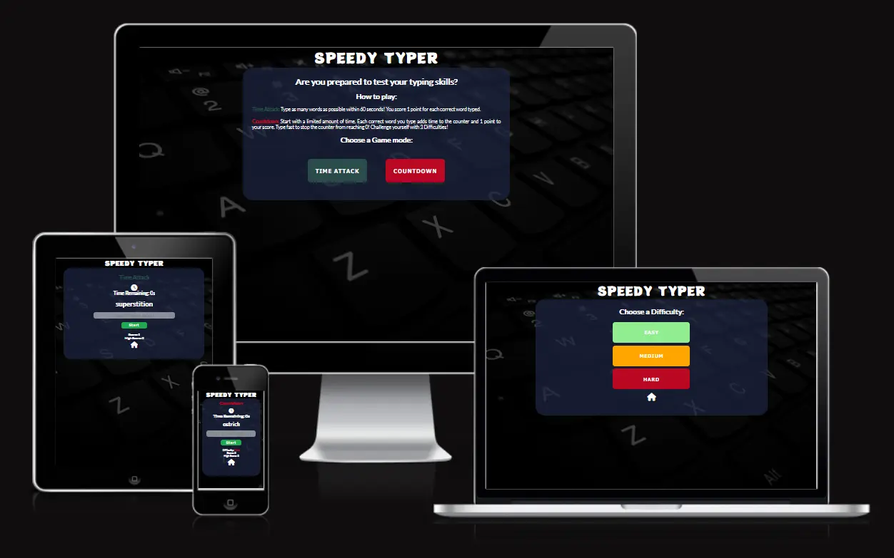
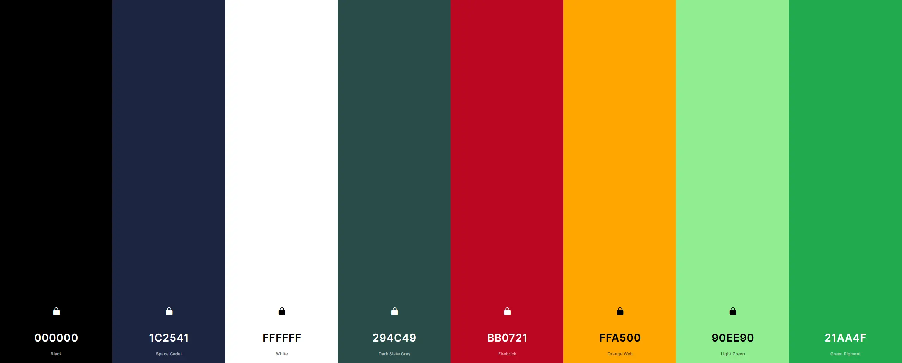
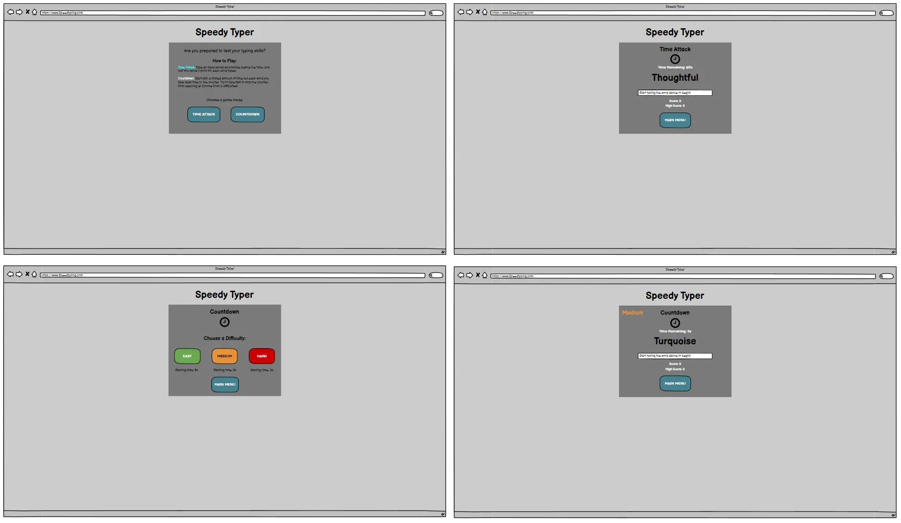
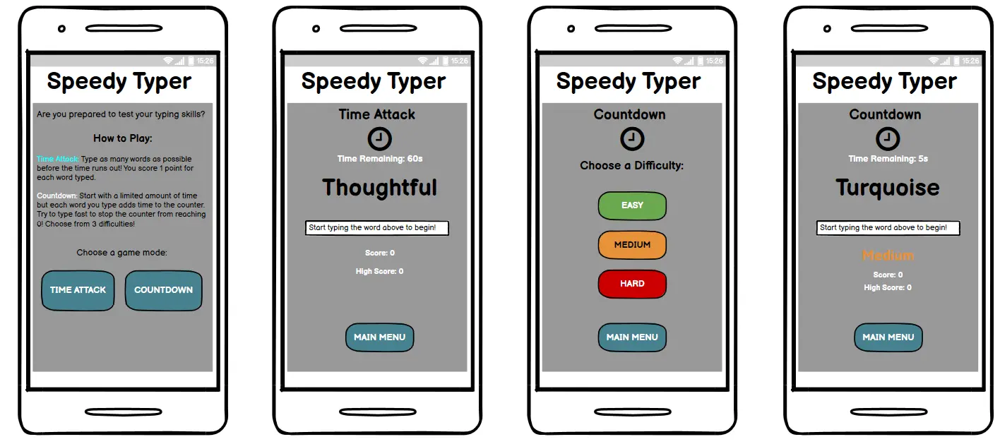
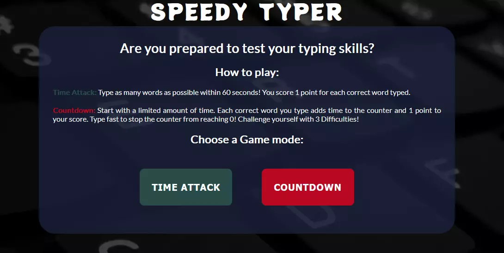
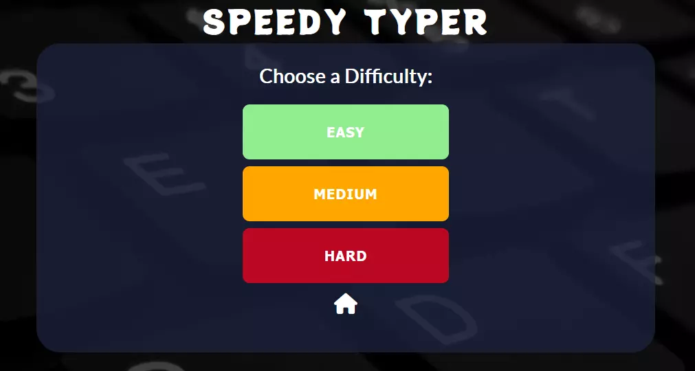
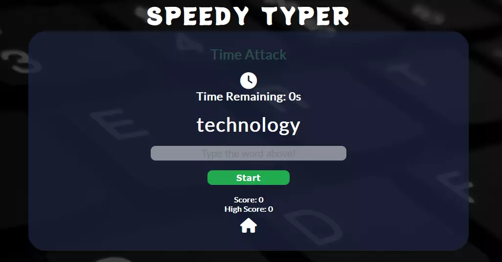
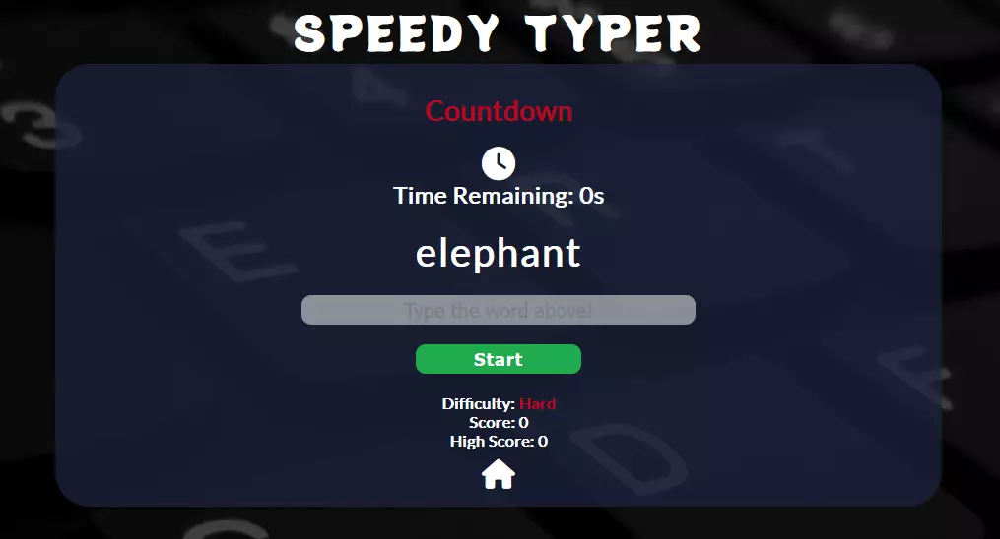
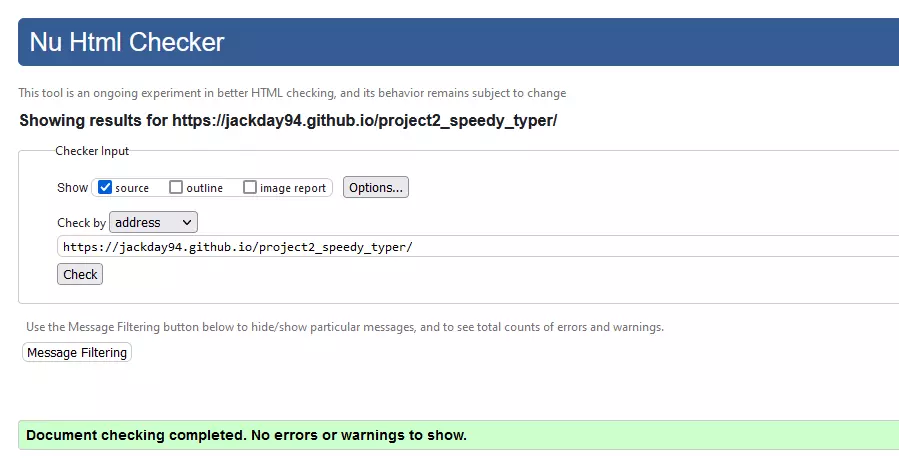
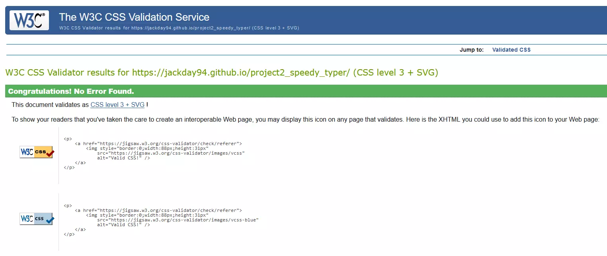

<h1 align="center">Speedy Typer</h1>

## Introduction
Speedy Typer is a Javascript based web game that allows users to test their typing skills through two unique game modes. This game is aimed at those who wish to test their typing skills and play a simple, fun game to try and challenge themselves to beat their high score. The game has 2 modes - 'Time Attack' and 'Countdown', to provide the user with a choice in how they wish to play.

[The live site can be accessed here.](https://jackday94.github.io/project2_speedy_typer/)

## Table of Contents

## Design

### Colours
I tried to keep the colours simple for the site, with the main font colour set to white to contrast the darker background and make the main content stand out. I chose to distinguish the 2 game modes with different colours so that the user can easily identify which mode they are playing. Likewise, the different difficulties are represented by a traffic light style colour scheme to help the user identify the difficulty they are playing.

### Font Styles
As the site is based around a typing game, I wanted the main font style to be clear and easily readable for the user. For this I used Google Fonts to choose the 'Lato' font style for the main game section content. I also wanted the main heading to seem playful to represent a game. I used Google Fonts and chose the 'Potta One' style for this.

### Images
Since the main purpose of the site is to play the typing game - I didn't want to overload the user with images, so I chose to only use a single image of a keyboard for the background of the site.

### Wireframes
I created the wireframes for this project using Balsamiq Wireframes.

Desktop

Mobile

## Features

### Existing Features

- __Main Menu__
    - This is the first page the user is met with when they load the site.
    - It provides information that tells the user how to play the game and what the different game modes are.
    - There are two buttons that take the user to the different game modes. 'Time Attack' loads the time attack game mode, and 'Countdown' loads the difficulty select menu for the countdown game mode.

- __Difficulty Select__
    - From this menu, the user can choose between the 3 difficulty options for the 'Countdown' game.
    - 3 large navigation buttons load the countdown game at a difficulty of the user's choice - Easy, Medium or Hard.
    - A home button at the bottom of the page takes user's back to the main menu when clicked.

- __Time Attack Game__
    - This is the game that is displayed when the user selects the 'time attack' button from the main menu.
    - The game features a start button that will set the timer to 60 seconds, display a random word, enable the text input box, disable the button and set the score to 0.
    - When the timer starts, it will begin to countdown by 1 second for 60 seconds until it reaches 0.
    - While the timer is active, the user must type the word that is displayed above the input box to score 1 point. Everytime the words match, the word above the input box is randomised from an array of words.
    - The high score is set when the user's score is greater than the high score value that is stored in local storage.
    - When the timer reaches 0, the input box is disabled and the start button is enabled again.
    - A home button at the bottom of the page will take the user back to the main menu.

- __Countdown Game__
    - This is the game that is displayed when the user selects 'countdown' from the main menu and chooses a difficulty.
    - The basic features and functionality of this game are the same as the time attack game mode.
    - Countdown starts the user with a limited amount of time depending on which difficulty they select. Easy starts with 8 seconds, Medium with 5, and Hard with 3.
    - Each time the user matches their word to the random word, the current time on the timer is increased by 2 seconds.
    - The timer will continue to countdown until it reaches 0, at which point the game ends. The user must therefore type as fast as possible to prevent the timer reaching 0.
    - The game displays the difficulty the user is playing on just above their score.
    - There are seperate high scores for each difficulty stored in local storage to prevent the user from overlapping their high score from a lower difficulty to a higher one.

### Future Features

- Game Sounds
    - I feel that adding sounds to the game would be a good way to improve the user experience. For example, a chime sound could play when the user enters a correct answer which would give them audio feedback that they answered correctly. Also sounds could play when the timer is low to let the user know that they are running low on time.

- Leaderboards
    - I would like to add a leaderboard which keeps a record of high scores and allows the user to enter their name to display ther score in the leaderboard. This could make the game more attractive to competetive players who wish to aim for the highest spot on the leaderboard.

- Game start on typing
    - I would like to make the game start when the user starts to type in the text box rather than using a start button. This would make starting the game more fluid as the user can just use their keyboard to start the game, rather than clicking on a button.

## Technologies

- HTML5 - Used for the structure and content of my web pages.
- CSS3 - Used for the styling of pages.
- JavaScript - Used to implement the interactive features of the site and create the main functionality of the game.
- [Font Awesome](https://fontawesome.com/) - For the timer icon used in the games.
- [Google fonts](https://fonts.google.com/) - Used to choose the fonts for my site.
- [favicon.io](https://favicon.io/) - Used to create the favicon for the site.
- [Gitpod](https://www.gitpod.io/) - Used as my code editor.
- [GitHub](https://github.com/) - Used for deploying and hosting my site.

## Testing

### Validator Testing

- HTML
    - No errors displayed when checking with the W3C markup validation service.
    

- CSS
    - No errors displayed when checking with the W3C CSS validation service.
    